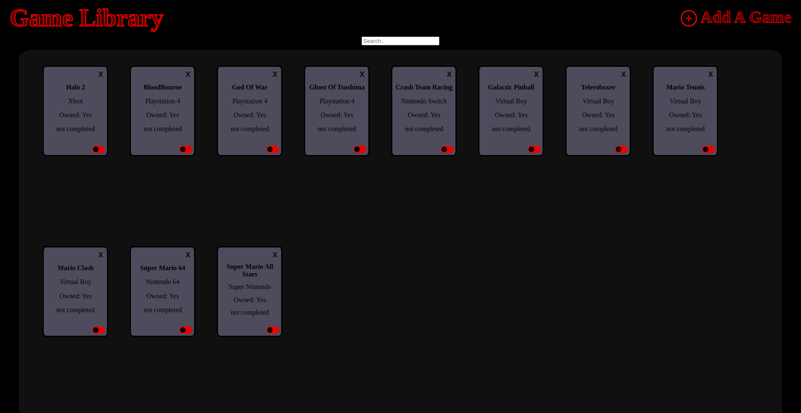

<h1 align="center">
   
  Game Library
   
  <image src="images/virtualboy.gif" width="50%"> 
</h1>

<h4 align="center">A game library inspired by the virtual boy console. I used JavaScript, HTML, and CSS for this project.</h4>

  <a href="#screenshots">Screenshots</a> •
  <a href="#goals">Goals</a> •
  <a href="#summary">Summary</a> •
  <a href="#author">Author</a> •
    <a href="#credits">Credits</a> •
  <a href="#license">License</a>

### ✨ [Live Demo](https://timjacksonm.github.io/Library)

## Screenshots

  
Show Image

  
  

## Goals:

- [✔️] Add a function that can take user's input and store a new book into an array.
- [✔️] Write a function that loops through the array and displays each book on the page.
- [✔️] Add a "New Book" button that brings up a form allowing users to input the details for the new book. ie author, title, number of pages, whether it's been read or not.
- [✔️] Add a button on each books display to remove the book from the library.
- [✔️] Add a button on each books display to change its read status.

**Extra Credit**

- [✔️] Add a Search bar that lets you search through the library.
- [ ] Give user option to save their data they input either by local storage or in the cloud!
- [ ] Add a day/night background setting to the page.
- [ ] Add transition DOM effects

**View Commits on project to see changes**

## Summary

I decided to unveil apart of my creative side and give this library a Virtual Boy Nintendo theme. This project focused on refining skills I learned from prior lessons. Manipulating an array and display all my game objects to the screen as game cards. Giving the games a "completion" tag or "not completed". Displaying a form when a new game button is clicked. With the form I added an eventListener that took the data and populated the array.
This was a nice creative break before digging into harder projects to come. 

## Author

👤 **Tim Jackson**

- Github: [@timjacksonm](https://github.com/timjacksonm)
- Twitter [@timjacksonm](https://twitter.com/timjacksonm)
- LinkedIn [@timjacksonm](https://linkedin.com/in/timjacksonm)

## Credits

This project idea was a part of my studies at The Odin Project's curriculum. You can see the lesson <a href="https://www.theodinproject.com/paths/full-stack-javascript/courses/javascript/lessons/library" target="_blank">here</a>!

## License

  <a href="https://choosealicense.com/licenses/mit/">
    

